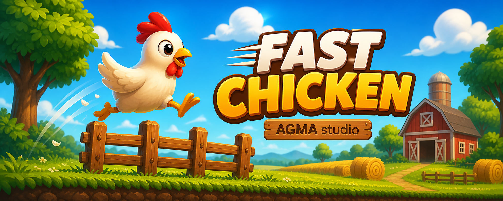

# Fast Chicken 🐔

Fast Chicken is a 2D endless runner game developed in Unity.

The player controls a chicken that automatically runs to the right, avoiding obstacles and collecting coins.
The main objective is to survive as long as possible and achieve the highest score based on distance and collected items.

## 🎮 Gameplay

- Automatic forward movement
- Jump and double jump mechanics
- Obstacle avoidance (fences, hay bales, barrels, rocks)
- Coin collection system
- Power-up system:
  - Corn boost increases speed
  - Temporary invincibility against obstacles

## 🧠 Technologies

- Unity Engine
- C#
- GitHub

## 📌 Project Status

Educational project – currently in development.
